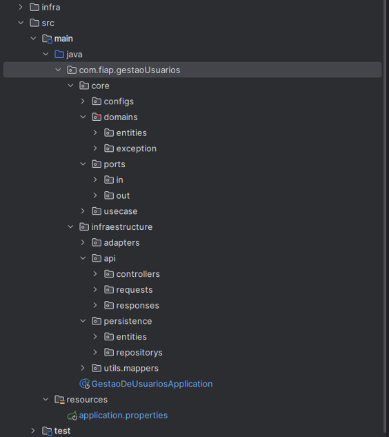

# Arquitetura do microserviço
# Visão Geral

Implementação de um microserviço, utilizando Java 17, framework Spring Boot, e arquitetura hexagonal. A aplicação base se conecta a um banco de dados PostgreSQL via JPA (Java Persistence API) e fornece funcionalidades CRUD (Create, Read, Update, Delete).

| Tecnologias Utilizadas            | Motivo da escolha                                                                                                               |
|-----------------------------      |---------------------------------------------------------------------------------------------------------------------------------|
| **Java 17**                       | Estabilidade e suporte contínuo, além da versão possuir melhorias de desempenho e novas funcionalidades, como records, pattern matching, e melhorias no garbage collector.                                                         |
| **Spring Boot**                   | Facilidade de configuração, desenvolvimento rápido e simples, facilitando a criação de microserviços por conta do suporte nativo para APIs RESTFul.                                                                |
| **Arquitetura Hexagonal**         | Separação de Preocupações, lógica de negócio isolada de infraestrutura. Testabilidade, facilita testes unitários e de integração. Flexibilidade, mudança de tecnologias sem afetar a lógica central.                                       |
| **JPA (Java Persistence API)**    | Abstração de Persistência: Facilita troca de tecnologias de banco de dados. Consultas dinâmicas, utilização de JPQL ou Criteria API. Integração com Spring Data, manipulação de dados simplificada.                   |
| **Banco de dados PostgreSQL**     | Open Source, sem custos de licenciamento. Confiabilidade e estabilidade, amplamente utilizado em produção. Performance, excelente para consultas complexas e grandes volumes de dados. |

# Estrutura do Projeto
A estrutura do projeto é organizada de acordo com a arquitetura hexagonal, também conhecida como arquitetura de ports and adapters. A estrutura de pastas segue o padrão abaixo:

